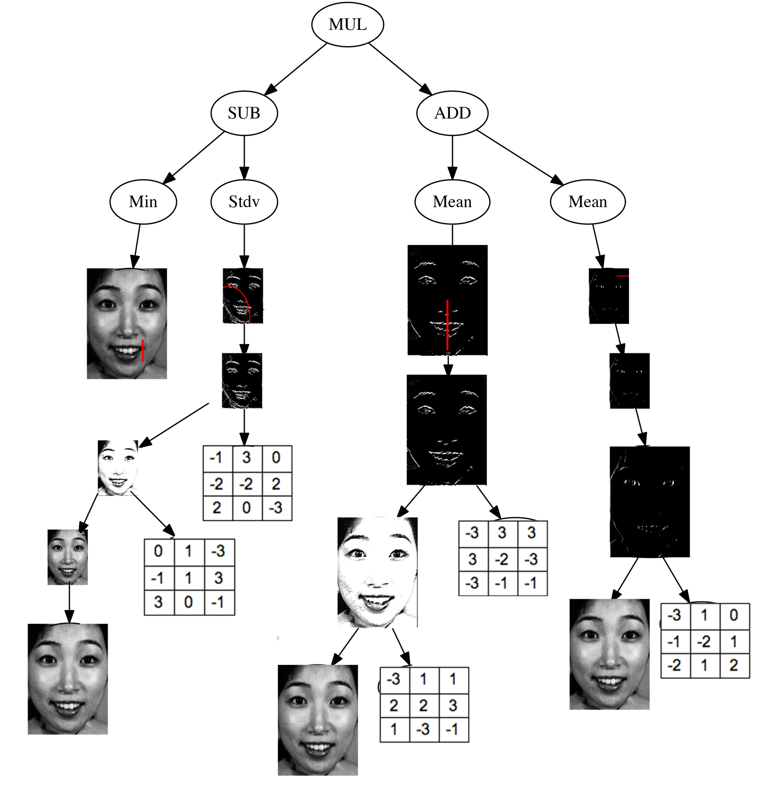
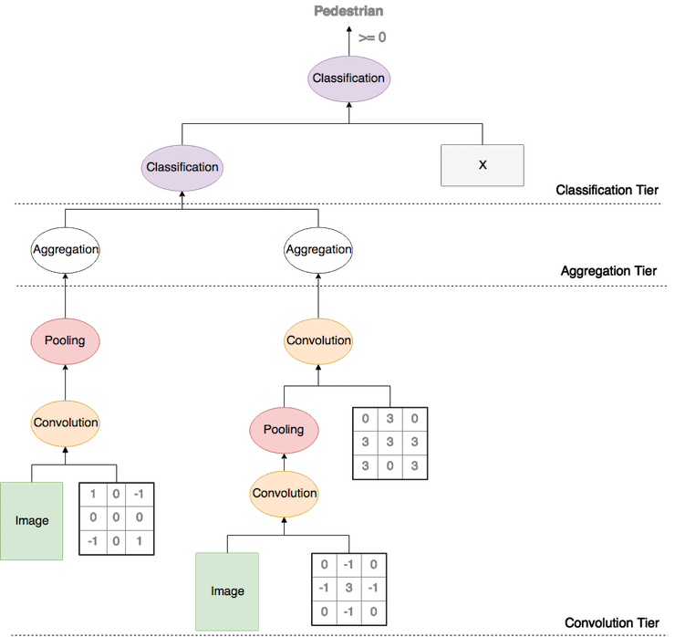

# ConvGP

This was my project as part of the requirements for my Honours degree in Computer Science at Victoria University of Wellington. A novel method for Binary image classification, utilising a memetic approach (Genetic programming combined with gradient descent)

## How to use?

I set this up to feature a similar API to sklearn. The model can be trained and predictions made in only three lines of code

```python
gp = stgp.ConvGP()
gp.fit(trainingX, trainingY)
predictions = gp.predict(testingX)
```

Any questions feel free to open an issue

## About
The key idea is to combine aspects from genetic programming and convolutional neural networks
to overcome various limitations of ConvNets, i.e.

- Need for manually crafted architectures
- Poor Interpretability. Although google brain appears to be doing some promising research in this area [here](https://distill.pub/2017/feature-visualization/), however a large limitation is still interpretability of feature interaction 
- Require large amounts of training data

The developed method uses strongly-typed genetic programming to automatically evolve trees which can be used for binary image classification. An example of an evolved tree is shown below



A breakdown of the tree architecture is given below, the structure is enforced using strongly-typed genetic programming.



The proposed method overcomes some of the aforementioned problems.

- The architecture is automatically evolved rather than manually crafted
- The solution offers high interpretability, as shown with the example above

Filter/kernel values are learnt through a combination of gradient descent and evolution, as gradient descent is run periodically throughout the process to optimise the values.

Papers to come, pending publishing.

## Citing

Part of this work was published in the 2018 IEEE Congress on Evolutionary Computation (CEC). Note however this did not include the gradient descent portion, but please still cite this work

https://ieeexplore.ieee.org/abstract/document/8477933

BibTeX:
```latex
@INPROCEEDINGS{8477933, 
author={B. {Evans} and H. {Al-Sahaf} and B. {Xue} and M. {Zhang}}, 
booktitle={2018 IEEE Congress on Evolutionary Computation (CEC)}, 
title={Evolutionary Deep Learning: A Genetic Programming Approach to Image Classification}, 
year={2018}, 
volume={}, 
number={}, 
pages={1-6}, 
keywords={convolution;feedforward neural nets;genetic algorithms;handwritten character recognition;image classification;learning (artificial intelligence);medical image processing;deep learning;genetic programming approach;image classification;cell images;convolutional neural networks;CNNs;genetic programming solution;image datasets;recognising handwritten digits;medical diagnosis;Computer architecture;Feature extraction;Machine learning;Visualization;Genetic programming;Task analysis;Image recognition;Genetic programming;Image classification;Deep learning;Feature extraction}, 
doi={10.1109/CEC.2018.8477933}, 
ISSN={}, 
month={July},}
```


#### Foot note
This work was originally written in [ECJ](https://cs.gmu.edu/~sean/papers/gecco17-ecj.pdf), and was based on some existing code from my supervisors work on [2TGP](http://www.sciencedirect.com/science/article/pii/S0957417412003867). The code base has since been ported to Python3, which is what you see attached here. This was done for a number of reasons, mainly the large number of available libraries which can reduce the overall code size (as originally code was written all from scratch) and the improved readability.
